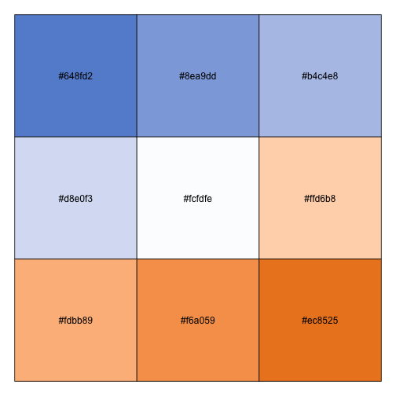

<!-- README.md is generated from README.Rmd. Please edit that file -->

<!-- badges: start -->

[](https://www.repostatus.org/#active)
[](https://github.com/AAGI-Org-AU-Public/AAGIPalettes/actions/workflows/R-CMD-check.yaml)
<!-- badges: end -->

# {AAGIPalettes} AAGI Colours for R 

This repository contains the code for the R package {AAGIPalettes},
which once installed in your R session (local or RStudio Server),
provides helper functions, data and palettes for working with AAGI
colours.

## Installation instructions

You can install {AAGIPalettes} like so:

``` r
if (!requireNamespace("remotes", quietly = TRUE)) {
  install.packages("remotes")
}
remotes::install_github("AAGI-Org-AU-Public/AAGIPalettes",
                        dependencies = TRUE
)
```

## Quick start

Following are some quick examples of {AAGIPalettes} functionality.

### Official Colours

{AAGIPalette} provides a data object of the official AAGI colours from
the comms guide. You can see the hex code values in a named vector like
so.

``` r
library("AAGIPalettes")

aagi_colours
#> AAGI Bright Green         AAGI Teal         AAGI Blue        AAGI Green 
#>         "#B6D438"         "#00808b"         "#648FD2"         "#54921E" 
#>       AAGI Yellow       AAGI Orange        AAGI Black         AAGI Grey 
#>         "#FFBC42"         "#ec8525"         "#414042"         "#F2F2F2"
```

### Viewing Colours

{AAGIPalette} provides limited functionality for viewing and working
with colours. You can plot the colours or palettes in the package as
follows.

``` r
display_aagi_cols("aagi_colours")
```


Display the “aagi_BuOr” palette with 9 stops.

``` r
display_aagi_cols(name = "aagi_BuOr", n = 9)
```



### Interpolating Colours

``` r
library(ggplot2)

x <- interpolate_aagi_colours()
# round the weights to clean up the legend, this is just an e.g. after all...
wt_vals <- x(length(unique(round(mtcars$wt, 1))))

ggplot(mtcars, aes(x = mpg, y = hp, colour = as.factor(round(wt, 1)))) +
geom_point() +
scale_colour_manual("Weight", values = wt_vals)
```


